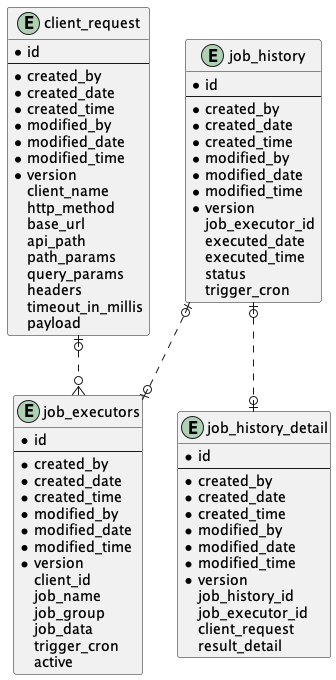

# CRON-SCHEDULER

spring project for cron scheduler, by default it only rest api call job using web client.



## Configuration Properties
Application Configuration Properties

| Property Name                                  | Property Type | Default Value | Description                                |
|------------------------------------------------|---------------|---------------|--------------------------------------------|
| cron.quartz.thread-pool                        | int           | 20            | quartz thread pool size                    |
| job.configuration.web-client.connect-time-out  | int           | 10            | web client connect time out configuration  |
| job.configuration.web-client.response-time-out | int           | 10            | web client response time out configuration |
| job.configuration.web-client.read-time-out     | int           | 10            | web client read time out configuration     |
| job.configuration.web-client.write-time-out    | int           | 10            | web client write time out configuration    |

## Environment Variable

| Environment Variable Name | Default Value                             | Description                        |
|---------------------------|-------------------------------------------|------------------------------------|
| SERVER_PORT               | 1000                                      | application port                   |
| DB_URL                    | r2dbc:postgresql://localhost:5432/cron_db | application db host                |
| DB_USER                   | user                                      | application db username credential |
| DB_PASS                   | password                                  | application db password credential |
| LOG_NAME                  | cron-scheduler.log                        | application log name               |
| APP_LOG_LEVEL             | INFO                                      | application log level              |
| MAX_LOG_HISTORY           | 14                                        | max application log history        |
| CONNECT_TIME_OUT          | 10                                        | web client job connect time out    |
| RESPONSE_TIME_OUT         | 10                                        | web client job response time out   |
| READ_TIME_OUT             | 10                                        | web client job read time out       |
| WRITE_TIME_OUT            | 10                                        | web client job write time out      |
| QUARTZ_THREAD_POOL        | 20                                        | quartz thread pool                 |
| WEB_CLIENT_JOB_LOG_LEVEL  | DEBUG                                     | web client job log level           |

## Swagger URL
```shell
http://localhost:{server_port}/swagger-ui.html
```

## How to Use
- Create Client Request
- Create Job Executor

## Create Callback Notification
- create class that implements `NotificationCallback` interface
 - add `@Service` annotation
- add `@Primary` annotation to make it primary bean
  Example:

```java
import com.nantaaditya.cronscheduler.model.dto.NotificationCallbackDTO;

@Service
@Primary
public class EmailNotificationCallback implements NotificationCallback {

  private final EmailService emailService;

  @Override
  public Mono<Boolean> notifySuccess(NotificationCallbackDTO notificationCallback) {
    return emailService.send(notificationCallback);
  }

  @Override
  public Mono<Boolean> notifyFailed(NotificationCallbackDTO notificationCallback) {
    return emailService.send(notificationCallback);
  }
}
```


## Build & Deploy Image
Build Jar
```shell
mvn install -DskipTests
```

Build Image
```shell
docker build -f .docker/Dockerfile -t nantaaditya/cron-scheduler:0.0.1 .
```

Run Image
```shell
docker run --env-file .deployment/.env.local --name cron-scheduler -p 1000:1000 -m512m nantaaditya/cron-scheduler:0.0.1
```

## Build & Deploy Openj9 Image
Build Jar
```shell
mvn install -DskipTests
```

Build Image
```shell
docker build -f .docker/Dockerfile-Openj9 -t nantaaditya/cron-scheduler:0.0.1-o9 .
```

Run Image
```shell
docker run --env-file .deployment/.env.local --name cron-scheduler-o9 -p 1000:1000 -m512m nantaaditya/cron-scheduler:0.0.1-o9
```

## Build & Deploy GraalVM Image

Build Image
```shell
docker buildx build -f .docker/Dockerfile-GraalVM -t nantaaditya/cron-scheduler:0.0.1-gvm .
```

Run Image
```shell
docker run --env-file .deployment/.env.local --name cron-scheduler-gvm -p 1000:1000 nantaaditya/cron-scheduler:0.0.1-gvm
```