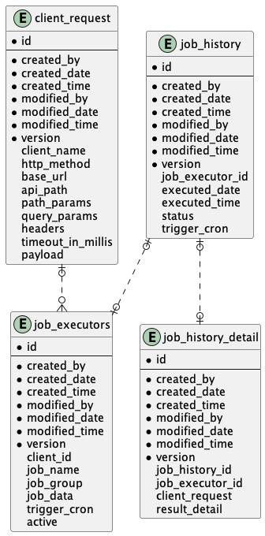

# cron-scheduler

A reactive Spring Boot service that schedules and executes HTTP callbacks on a cron trigger, backed by Quartz for scheduling and WebFlux/R2DBC for a fully non-blocking pipeline.

## Overview

`cron-scheduler` lets you register an HTTP request template (a **Client Request**) and a cron trigger (a **Job Executor**) that fires it. When the trigger runs, the service calls the configured endpoint via `WebClient`, records the outcome (`JobHistory` / `JobHistoryDetail`), and invokes a pluggable `NotificationCallback` on success or failure. Everything from the REST API to the job execution and database access is reactive (Project Reactor).

## Architecture

```
                    ┌───────────────────────┐
   REST API  ─────► │  Controller layer     │  (ClientRequest / JobExecutor / JobHistory)
                    └──────────┬────────────┘
                               │
                    ┌──────────▼────────────┐
                    │  Service layer         │  validation, quartz scheduling, persistence
                    └──────────┬────────────┘
                               │
        ┌──────────────────────┼───────────────────────┐
        │                      │                        │
┌───────▼───────┐   ┌──────────▼──────────┐   ┌─────────▼─────────┐
│ Quartz Trigger │──►│ WebClientJob        │──►│ ReactorEventBus /  │
│ (cron_trigger) │   │ (Quartz Job)        │   │ Sinks.Many          │
└────────────────┘   └──────────┬──────────┘   └─────────┬─────────┘
                                 │                        │
                                 ▼                        ▼
                       ┌───────────────────────────────────────┐
                       │ WebClientJobListener                  │
                       │  createJobHistory → execute (WebClient │
                       │  call w/ timeout) → handleResponse     │
                       └──────────┬──────────────────┬─────────┘
                                  │                  │
                          ┌───────▼──────┐   ┌────────▼─────────┐
                          │ R2DBC (Postgres)│ │ NotificationCallback│
                          │ job_history*    │ │ (pluggable bean)     │
                          └────────────────┘ └──────────────────────┘
```

Key ideas:
- **Quartz** owns cron scheduling (`JobExecutor` entities are materialized into Quartz triggers on startup/CRUD via `QuartzInitializerConfiguration` / `JobExecutorServiceImpl`).
- Each Quartz job firing (`WebClientJob`) doesn't call the endpoint directly — it publishes a `JobExecutionContext` onto a Reactor `Sinks.Many` event bus (`ReactorEventBus`), decoupling the Quartz thread pool from the actual reactive execution.
- `WebClientJobListener` subscribes to that bus once at startup and drives the whole pipeline: create a `JobHistory` row → run the HTTP call with a timeout (`ReactorJobExecutor`) → persist the result (`JobHistoryDetail`) → call `NotificationCallback`.
- `reqId` / `traceId` / `spanId` are carried per-job through Reactor `Context` (`ReactorLogContext`) and re-synced into SLF4J `MDC` at every thread hop, so concurrent job executions don't cross-contaminate log lines.
- Persistence is R2DBC/Postgres end-to-end — no blocking JDBC calls anywhere in the request or job path.

## Project Structure

```
src/main/java/com/nantaaditya/cronscheduler/
├── configuration/   Spring config: Quartz, Netty/WebClient, R2DBC, OpenAPI, observability
├── controller/      REST controllers (ClientRequest, JobExecutor, JobHistory) + exception handler
├── entity/          R2DBC entities (BaseEntity, ClientRequest, JobExecutor, JobHistory, JobHistoryDetail)
├── job/             Quartz Job implementation (WebClientJob) that publishes to the event bus
├── listener/        Quartz + Reactor listeners; WebClientJobListener drives the execution pipeline
├── model/
│   ├── constant/     Enums / constants (JobStatus, JobDataMapKey, exceptions)
│   ├── dto/          Internal DTOs (EventContext, JobResponse, NotificationCallbackDTO)
│   ├── request/      Inbound request DTOs (Create/Update *RequestDTO)
│   └── response/     Outbound response DTOs + the Response<T> envelope
├── properties/       @ConfigurationProperties classes (JobProperties, QuartzProperties)
├── repository/       R2DBC repositories + custom repository implementations
├── service/          Business logic (ClientRequestService, JobExecutorService, JobHistoryService, NotificationCallback)
├── util/             Reactor/MDC helpers, JSON helper, ID generation
└── validation/       Custom bean-validation annotations (cron expression, HTTP method)
```

Tests mirror this structure under `src/test/java`, plus `src/test/resources` for ddl/fixtures.

## Features

- **Client Request management** — CRUD for reusable HTTP request templates (method, base URL, path, path/query params, headers, payload, timeout).
- **Job Executor management** — CRUD for cron-triggered jobs bound to a Client Request, with enable/disable toggle and an on-demand instant run (`_run`).
- **Job History** — every execution is recorded (`job_history` + `job_history_detail`, including the request/response payload), with a retention-based cleanup endpoint.
- **Pluggable notifications** — implement `NotificationCallback` and expose it as the `@Primary` bean to receive success/failure callbacks (email, Slack, webhook, etc.).
- **Resilience** — per-execution timeout via `ReactorJobExecutor`, error fallback paths that still record history and notify on failure instead of dropping the job silently.
- **Tracing-aware logging** — B3 trace/span headers are propagated to the downstream HTTP call and mirrored into MDC for correlated logs.
- **OpenAPI/Swagger UI** and **Actuator + Prometheus + tracing** endpoints out of the box.

## API Reference

Base path: `/api`. All responses are wrapped in `Response<T>` (`{ success, data, errors }`).

### Client Request — `/api/client_request`

| Method | Path            | Description                                  |
|--------|-----------------|-----------------------------------------------|
| POST   | `/`             | Create a client request template              |
| PUT    | `/`             | Update a client request template              |
| GET    | `/`             | List client requests (`page`, `size`)         |
| GET    | `/{clientId}`   | Get a client request by id                    |
| DELETE | `/{clientId}`   | Delete a client request by id                 |

### Job Executor — `/api/job_executor`

| Method | Path                     | Description                                  |
|--------|--------------------------|-----------------------------------------------|
| POST   | `/`                      | Create a job executor (schedules a Quartz trigger) |
| PUT    | `/`                      | Update a job executor                          |
| GET    | `/`                      | List job executors (`page`, `size`)            |
| GET    | `/{id}`                  | Get a job executor by id                       |
| DELETE | `/{id}`                  | Delete a job executor (unschedules the trigger)|
| PUT    | `/{id}/_toggle/{enable}` | Enable/disable a job executor                  |
| GET    | `/{id}/_run`             | Trigger an instant, one-off run                |

### Job History — `/api/job_history`

| Method | Path | Description                                                     |
|--------|------|--------------------------------------------------------------------|
| GET    | `/`  | List job history (`page`, `size`)                                  |
| DELETE | `/`  | Purge history older than `retentionDays` (default `30`)            |

Interactive docs: `http://localhost:{server_port}/swagger-ui.html`

### Extending notifications

Implement `NotificationCallback` and register it as the primary bean to plug in your own delivery channel:

```java
import com.nantaaditya.cronscheduler.model.dto.NotificationCallbackDTO;

@Service
@Primary
public class EmailNotificationCallback implements NotificationCallback {

  private final EmailService emailService;

  @Override
  public Mono<Boolean> notifySuccess(NotificationCallbackDTO notificationCallback) {
    return emailService.send(notificationCallback);
  }

  @Override
  public Mono<Boolean> notifyFailed(NotificationCallbackDTO notificationCallback) {
    return emailService.send(notificationCallback);
  }
}
```

## Configuration

### Application configuration properties

| Property Name                                  | Property Type | Default Value                     | Description                                |
|-------------------------------------------------|---------------|-----------------------------------|---------------------------------------------|
| cron.quartz.instance-name                       | String        | cron-scheduler                    | quartz instance name                       |
| cron.quartz.thread-pool-class                   | String        | org.quartz.simpl.SimpleThreadPool | quartz thread pool implementation          |
| cron.quartz.thread-name                         | String        | cron-scheduler                    | quartz thread name                         |
| cron.quartz.thread-count                        | int           | 20                                | quartz thread count                        |
| cron.quartz.thread-priority                     | int           | 5                                 | quartz thread priority                     |
| cron.quartz.job-store-class                     | String        | org.quartz.simpl.RAMJobStore      | quartz job store implementation            |
| cron.quartz.misfire-threshold                   | int           | 60000                             | quartz misfire threshold configuration     |
| job.configuration.web-client.connect-time-out   | int           | 10                                | web client connect time out configuration  |
| job.configuration.web-client.response-time-out  | int           | 10                                | web client response time out configuration |
| job.configuration.web-client.read-time-out      | int           | 10                                | web client read time out configuration     |
| job.configuration.web-client.write-time-out     | int           | 10                                | web client write time out configuration    |

### Environment variables

| Environment Variable Name | Default Value                             | Description                             |
|----------------------------|--------------------------------------------|-------------------------------------------|
| SERVER_PORT                | 1000                                       | application port                          |
| DB_URL                     | r2dbc:postgresql://localhost:5432/cron_db  | R2DBC connection URL                      |
| DB_USER                    | user                                       | application db username credential        |
| DB_PASS                    | password                                   | application db password credential        |
| DB_POOL_SIZE               | 5                                          | R2DBC connection pool initial size        |
| DB_MAX_POOL_SIZE           | 10                                         | R2DBC connection pool max size            |
| DB_IDLE_TIME               | 30s                                        | R2DBC connection pool max idle time       |
| DB_LIFE_TIME                | 60s                                         | R2DBC connection pool max life time        |
| LOG_NAME                   | cron-scheduler.log                         | application log file name                 |
| APP_LOG_LEVEL              | INFO                                       | root application log level                |
| MAX_LOG_HISTORY            | 14                                         | max application log history (days)        |
| WEB_CLIENT_JOB_LOG_LEVEL    | DEBUG                                       | reactor-netty http client wiretap log level |
| CONNECT_TIME_OUT           | 10                                         | web client job connect time out (s)       |
| RESPONSE_TIME_OUT          | 10                                         | web client job response time out (s)      |
| READ_TIME_OUT              | 10                                         | web client job read time out (s)          |
| WRITE_TIME_OUT              | 10                                          | web client job write time out (s)          |
| QUARTZ_INSTANCE_NAME       | cron-scheduler                             | quartz instance name                      |
| QUARTZ_THREAD_POOL_CLASS   | org.quartz.simpl.SimpleThreadPool          | quartz thread pool implementation class   |
| QUARTZ_THREAD_NAME         | cron-scheduler                             | quartz thread pool name                   |
| QUARTZ_THREAD_COUNT        | 20                                         | quartz thread pool size                   |
| QUARTZ_THREAD_PRIORITY     | 5                                           | quartz thread priority                    |
| QUARTZ_JOB_STORE_CLASS     | org.quartz.simpl.RAMJobStore               | quartz job store implementation class     |
| QUARTZ_MISFIRE_THRESHOLD   | 60000                                       | quartz misfire threshold (ms)             |

## Local Development

Prerequisites: JDK 21, a running Postgres instance (or Docker), Maven (or use the bundled `./mvnw`).

```shell
# start a local Postgres (adjust credentials to match application.yml defaults)
docker run --name cron-scheduler-db -e POSTGRES_DB=cron_db \
  -e POSTGRES_USER=user -e POSTGRES_PASSWORD=password \
  -p 5432:5432 -d postgres:16

# run the app (schema is applied automatically from src/main/resources/ddl.sql)
./mvnw spring-boot:run

# run tests
./mvnw test
```

The app reads configuration from `src/main/resources/application.yml`, with every value overridable via the environment variables listed above (e.g. `DB_URL`, `DB_USER`, `DB_PASS`, `SERVER_PORT`).

Once running:
- Swagger UI: `http://localhost:{server_port}/swagger-ui.html`
- Actuator: `http://localhost:{server_port}/actuator`

### Build & deploy image

Build Jar
```shell
mvn install -DskipTests
```

Build Image
```shell
docker build -f .docker/Dockerfile -t nantaaditya/cron-scheduler:0.0.1 .
```

Run Image
```shell
docker run --env-file .deployment/.env.local --name cron-scheduler -p 1000:1000 -m512m nantaaditya/cron-scheduler:0.0.1
```

### Build & deploy OpenJ9 image

Build Jar
```shell
mvn install -DskipTests
```

Build Image
```shell
docker build -f .docker/Dockerfile-Openj9 -t nantaaditya/cron-scheduler:0.0.1-o9 .
```

Run Image
```shell
docker run --env-file .deployment/.env.local --name cron-scheduler-o9 -p 1000:1000 -m512m nantaaditya/cron-scheduler:0.0.1-o9
```

### Build & deploy GraalVM image

Build Image
```shell
docker buildx build -f .docker/Dockerfile-GraalVM -t nantaaditya/cron-scheduler:0.0.1-gvm .
```

Run Image
```shell
docker run --env-file .deployment/.env.local --name cron-scheduler-gvm -p 1000:1000 nantaaditya/cron-scheduler:0.0.1-gvm
```

## Database

Postgres, accessed reactively via R2DBC. Schema is defined in `src/main/resources/ddl.sql` and applied on startup.



| Table                | Purpose                                                                 |
|-----------------------|--------------------------------------------------------------------------|
| `client_request`      | Reusable HTTP request template: method, base URL, path, params, headers, payload, timeout |
| `job_executor`        | Cron-triggered job bound to a `client_request` (`client_id`), with its trigger cron expression and active flag |
| `job_history`         | One row per job execution, tracking `job_executor_id`, execution time, status, and the cron expression used |
| `job_history_detail`  | Per-execution detail: the actual `client_request` payload sent and the `result_detail` response captured |

All tables share the same audit columns (`created_by`, `created_date`, `created_time`, `modified_by`, `modified_date`, `modified_time`, `version`) via `BaseEntity`, and use TSID-generated `varchar(64)` primary keys.

Indexes: `client_request.client_name`, `job_executor.job_name`, `job_history_detail.job_history_id`.
