# Cron Scheduler API Reference

> Generated from `@RestController` classes under `src/main/java/com/nantaaditya/cronscheduler/controller`.
> Last modified: 2026-07-13

## Shared Conventions

### Headers

No enforced global headers detected — no `OncePerRequestFilter`/`HandlerInterceptor` reading request headers was found in the codebase. Only framework-default headers apply (e.g. `Content-Type: application/json` on bodied requests). No endpoint declares a method-specific `@RequestHeader` parameter either.

### Response Envelope

Every endpoint returns `Mono<Response<T>>` (`com.nantaaditya.cronscheduler.model.response.Response`), serialized with `@JsonInclude(NON_NULL)` — `data` is omitted on error, `errors` is omitted on success.

| Field | Type | Description |
|---|---|---|
| success | Boolean | Whether the request completed successfully |
| data | Object / Array | Endpoint-specific payload; present only when `success` is `true` |
| errors | Object (Map<String, Array of String>) | Field name → list of violation messages; present only when `success` is `false` |

Success shape:
```json
{
  "success": true,
  "data": {}
}
```

Error shape:
```json
{
  "success": false,
  "errors": {
    "fieldName": ["ReasonCode"]
  }
}
```

### Error Handling (`RestExceptionHandler`, `@RestControllerAdvice`)

| Exception | HTTP Status | Reachability |
|---|---|---|
| `InvalidParameterException` | 400 | **Reachable** — thrown explicitly by service-layer business checks (existence/uniqueness). This is the only error path actually exercised by the endpoints below. |
| `MethodArgumentNotValidException` | 400 | Declared but **not currently reachable** — would fire on `@Valid`/`@Validated` request-body failures, but no controller method uses `@Valid`/`@Validated`, despite `@NotNull`/`@Size`/etc. annotations being present on the request DTOs. |
| `ConstraintViolationException` | 400 | Declared but **not currently reachable** for the same reason — path-variable constraints like `@NotBlank` on `JobExecutorController#find`/`#delete` require class-level `@Validated`, which is absent. |

Any other unhandled exception falls through to Spring Boot/WebFlux's default error handling (500, generic `{"timestamp":..., "path":..., "status":500, "error":...}` body — **not** the app's `Response` envelope).

---

## Job History Controller (`/api/job_history`)

### 1. Find All Job History

| HTTP Method | Path | HTTP Header |
|---|---|---|
| GET | `/api/job_history` | Standard headers — see Shared Conventions |

**Request Body**

No request body — see path/query parameters

| Field | Type | Mandatory | Description |
|---|---|---|---|
| page | Integer | O | Zero-based page index (default `0`) |
| size | Integer | O | Page size (default `10`) |

**Response Body**
```json
{
  "success": true,
  "data": [
    {
      "id": "",
      "jobExecutorId": "",
      "executedDate": "2026-07-13",
      "executedTime": "00:00:00",
      "status": "",
      "triggerCron": "",
      "clientRequest": {},
      "result": {}
    }
  ]
}
```

| Field | Type | Description |
|---|---|---|
| id | String | (inferred) TSID identifier of the job history record |
| jobExecutorId | String | Id of the `JobExecutor` this run belongs to |
| executedDate | String (date) | Date the job ran |
| executedTime | String (time) | Time the job ran |
| status | String | (inferred) Execution outcome status of the run |
| triggerCron | String | Cron expression that triggered this run |
| clientRequest | Object | (inferred) Snapshot of the client request payload used for this run |
| result | Object | (inferred) `clientResponse` portion extracted from the stored execution result |

details:
- `executedDate` formatted `yyyy-MM-dd` (`@JsonFormat`)
- `executedTime` formatted `HH:mm:ss` (`@JsonFormat`)
- `result` is extracted as `resultMap.get("clientResponse")` from the stored result JSON (`JobHistoryServiceImpl.toResult`)

**List Response Code**

| Code | Description |
|---|---|
| 200 | Success — see Shared Conventions |

**Sequence Flow**
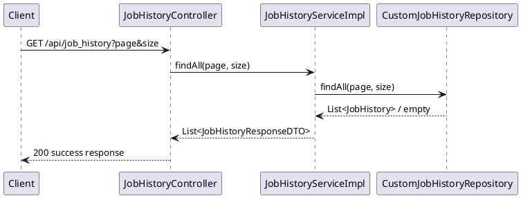

---

### 2. Remove Obsolete Job History

| HTTP Method | Path | HTTP Header |
|---|---|---|
| DELETE | `/api/job_history` | Standard headers — see Shared Conventions |

**Request Body**

No request body — see path/query parameters

| Field | Type | Mandatory | Description |
|---|---|---|---|
| retentionDays | Integer | O | Records older than `now - retentionDays` are deleted (default `30`) |

**Response Body**
```json
{
  "success": true,
  "data": true
}
```

| Field | Type | Description |
|---|---|---|
| data | Boolean | `true` once obsolete history/detail records are removed |

**List Response Code**

| Code | Description |
|---|---|
| 200 | Success — see Shared Conventions |

**Sequence Flow**
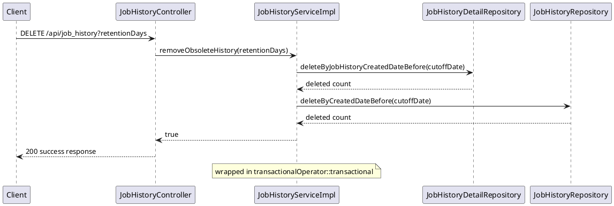

---

## Client Request Controller (`/api/client_request`)

### 3. Create Client Request (Web Client Job)

| HTTP Method | Path | HTTP Header |
|---|---|---|
| POST | `/api/client_request` | Standard headers — see Shared Conventions |

**Request Body**
```json
{
  "clientName": "",
  "httpMethod": "",
  "baseUrl": "",
  "apiPath": "",
  "pathParams": {},
  "queryParams": {},
  "headers": {},
  "payload": {},
  "timeoutInMillis": 0
}
```

| Field | Type | Mandatory | Length | Description |
|---|---|---|---|---|
| clientName | String | M | 255 | Unique name identifying this client request definition |
| httpMethod | String | M | - | HTTP method to invoke (`POST`/`PUT`/`GET`/`DELETE`, validated by `@HttpMethodMustValid`) |
| baseUrl | String | M | 255 | Base URL of the downstream service (validated as a URL) |
| apiPath | String | M | 255 | Path appended to `baseUrl` for the downstream call |
| pathParams | Object (Map<String,String>) | O | - | (inferred) Path parameter placeholders substituted into `apiPath` |
| queryParams | Object (Map<String,String>) | O | - | (inferred) Query string parameters appended to the downstream call |
| headers | Object (Map<String, Array of String>) | M | - | Headers sent with the downstream call |
| payload | Object | O | - | (inferred) Request body sent to the downstream call |
| timeoutInMillis | Integer | M | - | Downstream call timeout in milliseconds (primitive `int`, defaults to `0` if omitted) |

**Response Body**
```json
{
  "success": true,
  "data": {
    "id": "",
    "clientName": "",
    "httpMethod": "",
    "baseUrl": "",
    "apiPath": "",
    "pathParams": {},
    "queryParams": {},
    "headers": {},
    "timeoutInMillis": 0,
    "payload": {}
  }
}
```

| Field | Type | Description |
|---|---|---|
| id | String | (inferred) TSID identifier of the client request record |
| clientName | String | Echoed from request |
| httpMethod | String | Echoed from request |
| baseUrl | String | Echoed from request |
| apiPath | String | Echoed from request |
| pathParams | Object | Echoed from request |
| queryParams | Object | Echoed from request |
| headers | Object | Echoed from request |
| timeoutInMillis | Integer | Echoed from request |
| payload | Object | Echoed from request (returned as the stored payload string) |

details:
- `id` generated via `IdGenerator.createId()` (lowercase TSID) at creation time — this is the shape reused by every `ClientResponseDTO` in this document

**List Response Code**

| Code | Description |
|---|---|
| 200 | Success — see Shared Conventions |
| 400 | `clientName: AlreadyExists` — a client request with this `clientName` already exists (`InvalidParameterException`) |

**Sequence Flow**
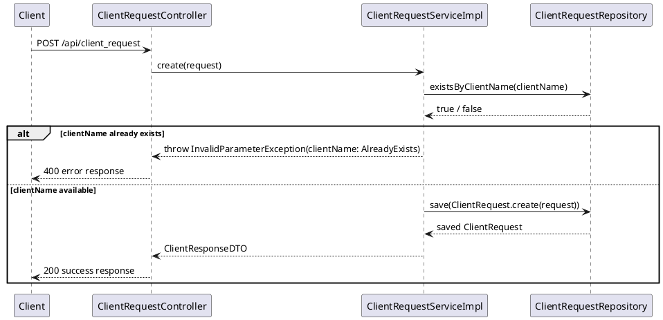

---

### 4. Update Client Request (Web Client Job)

| HTTP Method | Path | HTTP Header |
|---|---|---|
| PUT | `/api/client_request` | Standard headers — see Shared Conventions |

**Request Body**

Same shape/table as endpoint 3 (`CreateClientRequestDTO`/`UpdateClientRequestDTO` share identical fields via `BaseClientRequestDTO`).

Note: the record to update is looked up by **`clientName`**, not by an id field — `clientName` here must match an *existing* record.

**Response Body**

Same shape/table as endpoint 3 — `ClientResponseDTO`.

**List Response Code**

| Code | Description |
|---|---|
| 200 | Success — see Shared Conventions |
| 400 | `clientName: NotExists` — no client request with this `clientName` exists (`InvalidParameterException`) |

**Sequence Flow**
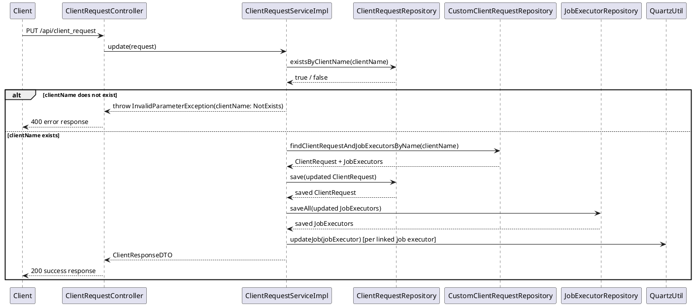

---

### 5. Find All Client Requests

| HTTP Method | Path | HTTP Header |
|---|---|---|
| GET | `/api/client_request` | Standard headers — see Shared Conventions |

**Request Body**

No request body — see path/query parameters

| Field | Type | Mandatory | Description |
|---|---|---|---|
| page | Integer | O | Zero-based page index (default `0`) |
| size | Integer | O | Page size (default `10`) |

**Response Body**

`Array of ClientResponseDTO` — same field table as endpoint 3.
```json
{
  "success": true,
  "data": [ { "id": "", "clientName": "", "httpMethod": "", "baseUrl": "", "apiPath": "", "pathParams": {}, "queryParams": {}, "headers": {}, "timeoutInMillis": 0, "payload": {} } ]
}
```

**List Response Code**

| Code | Description |
|---|---|
| 200 | Success — see Shared Conventions |

**Sequence Flow**
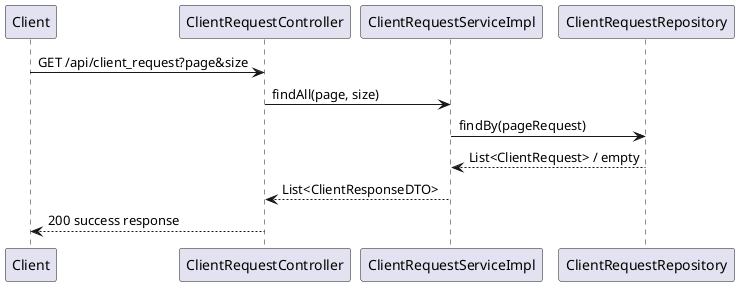

---

### 6. Get Client Request By Id

| HTTP Method | Path | HTTP Header |
|---|---|---|
| GET | `/api/client_request/{clientId}` | Standard headers — see Shared Conventions |

**Request Body**

No request body — see path/query parameters

| Field | Type | Mandatory | Description |
|---|---|---|---|
| clientId | String | M | Id of the client request record to fetch |

**Response Body**

`ClientResponseDTO` — same field table as endpoint 3.

**List Response Code**

| Code | Description |
|---|---|
| 200 | Success — see Shared Conventions |
| 400 | `clientId: NotExists` — no client request with this id exists (`InvalidParameterException`) |

**Sequence Flow**
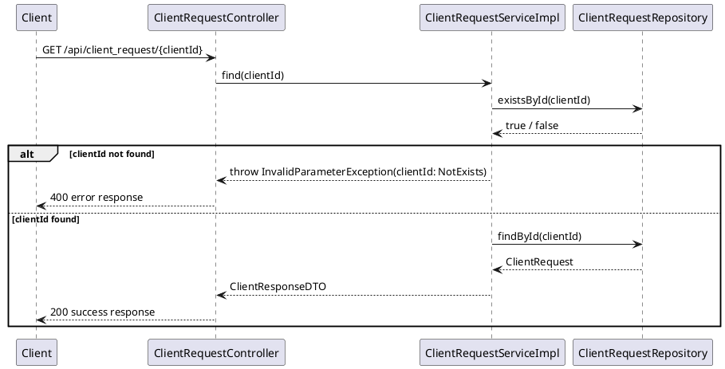

---

### 7. Delete Client Request By Id

| HTTP Method | Path | HTTP Header |
|---|---|---|
| DELETE | `/api/client_request/{clientId}` | Standard headers — see Shared Conventions |

**Request Body**

No request body — see path/query parameters

| Field | Type | Mandatory | Description |
|---|---|---|---|
| clientId | String | M | Id of the client request record to delete (cascades to its job executors and their Quartz jobs) |

**Response Body**
```json
{ "success": true, "data": true }
```

| Field | Type | Description |
|---|---|---|
| data | Boolean | `true` once the client request and its linked job executors are removed |

**List Response Code**

| Code | Description |
|---|---|
| 200 | Success — see Shared Conventions |
| 400 | `clientId: NotExists` — no client request with this id exists (`InvalidParameterException`) |

**Sequence Flow**
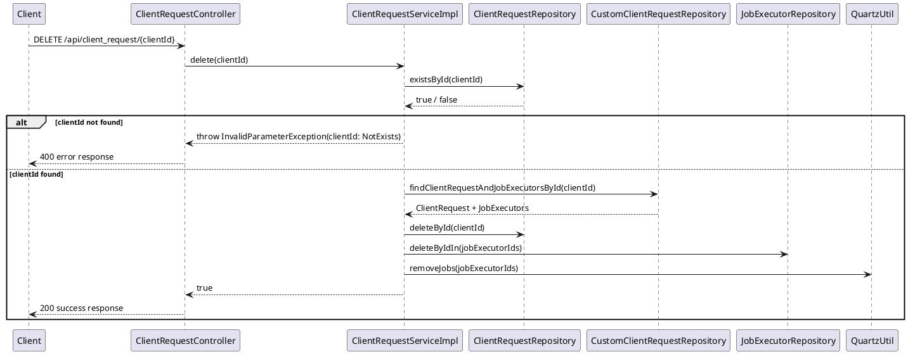

---

## Job Executor Controller (`/api/job_executor`)

### 8. Create Job Executor

| HTTP Method | Path | HTTP Header |
|---|---|---|
| POST | `/api/job_executor` | Standard headers — see Shared Conventions |

**Request Body**
```json
{
  "clientId": "",
  "cronTriggerExpression": "",
  "enable": false,
  "jobName": ""
}
```

| Field | Type | Mandatory | Length | Description |
|---|---|---|---|---|
| clientId | String | M | - | Id of an existing `ClientRequest` this job executor will invoke |
| cronTriggerExpression | String | M | - | Quartz cron expression for the trigger (validated by `@CronMustValid`) |
| enable | Boolean | M | - | Whether the Quartz job is active on creation (primitive `boolean`, defaults to `false` if omitted) |
| jobName | String | M | - | Unique job name registered in Quartz |

**Response Body**
```json
{
  "success": true,
  "data": {
    "jobExecutorId": "",
    "jobName": "",
    "jobGroup": "",
    "triggerCron": "",
    "enable": false,
    "clientRequest": {}
  }
}
```

| Field | Type | Description |
|---|---|---|
| jobExecutorId | String | (inferred) TSID identifier of the job executor record |
| jobName | String | Echoed from request |
| jobGroup | String | (inferred) Fixed Quartz job group constant (`WebClientJob.WEB_CLIENT_JOB_GROUP`) |
| triggerCron | String | Echoed cron expression |
| enable | Boolean | Current active/inactive state |
| clientRequest | Object (`ClientResponseDTO`) | The linked client request — see endpoint 3's response field table |

**List Response Code**

| Code | Description |
|---|---|
| 200 | Success — see Shared Conventions |
| 400 | `clientId: NotExists` and/or `jobName: AlreadyExists` (`InvalidParameterException`) |

**Sequence Flow**
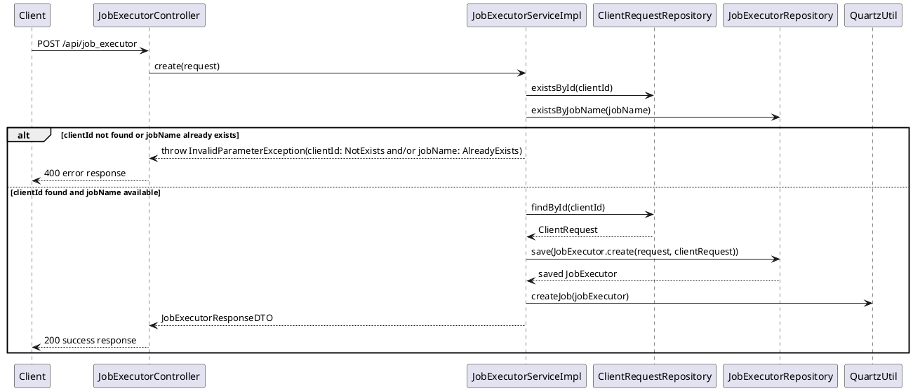

---

### 9. Update Job Executor

| HTTP Method | Path | HTTP Header |
|---|---|---|
| PUT | `/api/job_executor` | Standard headers — see Shared Conventions |

**Request Body**
```json
{
  "clientId": "",
  "cronTriggerExpression": "",
  "enable": false,
  "jobExecutorId": ""
}
```

| Field | Type | Mandatory | Length | Description |
|---|---|---|---|---|
| clientId | String | M | - | Id of the `ClientRequest` this job executor invokes |
| cronTriggerExpression | String | M | - | Quartz cron expression for the trigger (validated by `@CronMustValid`) |
| enable | Boolean | M | - | Whether the Quartz job is active (primitive `boolean`, defaults to `false` if omitted) |
| jobExecutorId | String | M | - | Id of the job executor record to update |

**Response Body**

Same shape/table as endpoint 8 — `JobExecutorResponseDTO`.

**List Response Code**

| Code | Description |
|---|---|
| 200 | Success — see Shared Conventions |
| 400 | `clientId: NotExists` and/or `jobExecutorId: NotExists` (`InvalidParameterException`) |

**Sequence Flow**
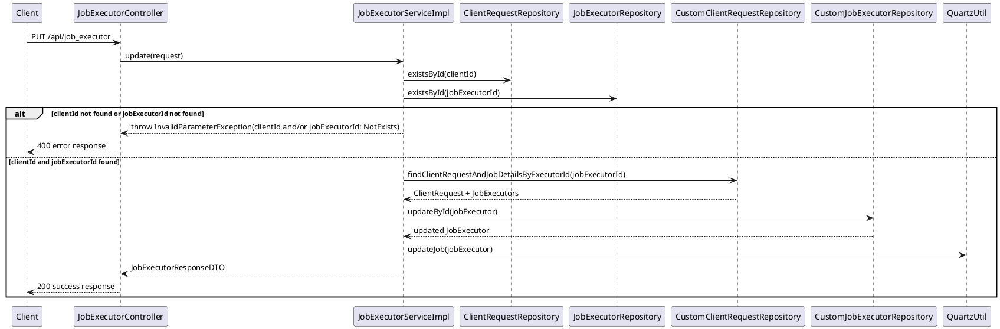

---

### 10. Find All Job Executors

| HTTP Method | Path | HTTP Header |
|---|---|---|
| GET | `/api/job_executor` | Standard headers — see Shared Conventions |

**Request Body**

No request body — see path/query parameters

| Field | Type | Mandatory | Description |
|---|---|---|---|
| page | Integer | O | Zero-based page index (default `0`) |
| size | Integer | O | Page size (default `1`) |

**Response Body**

`Array of JobExecutorResponseDTO` — same field table as endpoint 8.

**List Response Code**

| Code | Description |
|---|---|
| 200 | Success — see Shared Conventions |

**Sequence Flow**
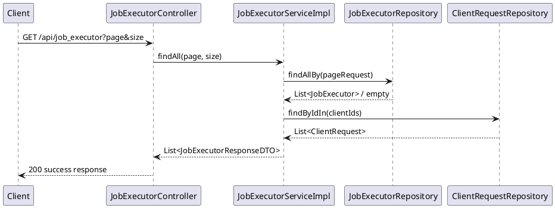

---

### 11. Find Job Executor By Id

| HTTP Method | Path | HTTP Header |
|---|---|---|
| GET | `/api/job_executor/{id}` | Standard headers — see Shared Conventions |

**Request Body**

No request body — see path/query parameters

| Field | Type | Mandatory | Description |
|---|---|---|---|
| id | String | M | Id of the job executor to fetch (`@NotBlank` present on the DTO field, but **not enforced** — no class-level `@Validated` on this controller) |

**Response Body**

`JobExecutorResponseDTO` — same field table as endpoint 8.

**List Response Code**

| Code | Description |
|---|---|
| 200 | Success — see Shared Conventions |
| 400 | `id: NotExists` (`InvalidParameterException`) |

**Sequence Flow**
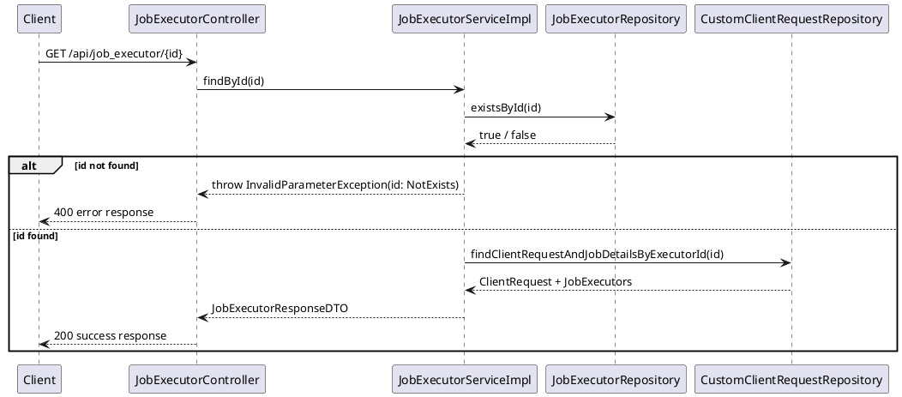

---

### 12. Delete Job Executor By Id

| HTTP Method | Path | HTTP Header |
|---|---|---|
| DELETE | `/api/job_executor/{id}` | Standard headers — see Shared Conventions |

**Request Body**

No request body — see path/query parameters

| Field | Type | Mandatory | Description |
|---|---|---|---|
| id | String | M | Id of the job executor to delete (`@NotBlank` present, **not enforced** — see endpoint 11) |

**Response Body**
```json
{ "success": true, "data": true }
```

| Field | Type | Description |
|---|---|---|
| data | Boolean | `true` once the job executor is deleted and its Quartz job removed |

**List Response Code**

| Code | Description |
|---|---|
| 200 | Success — see Shared Conventions |
| 400 | `id: NotExists` (`InvalidParameterException`) |

**Sequence Flow**
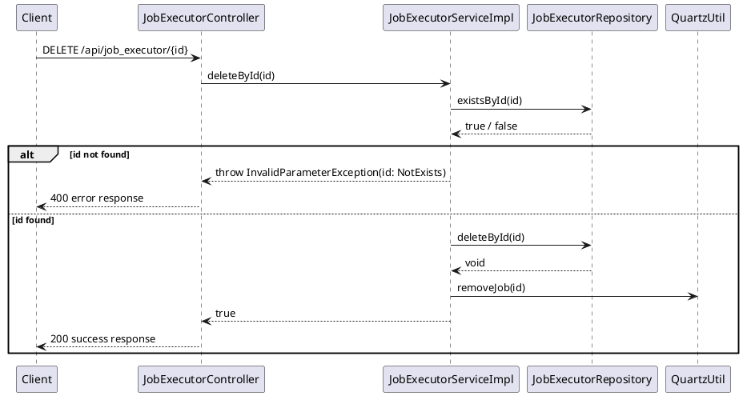

---

### 13. Toggle Job Executor

| HTTP Method | Path | HTTP Header |
|---|---|---|
| PUT | `/api/job_executor/{id}/_toggle/{enable}` | Standard headers — see Shared Conventions |

**Request Body**

No request body — see path/query parameters

| Field | Type | Mandatory | Description |
|---|---|---|---|
| id | String | M | Id of the job executor to toggle |
| enable | Boolean | M | New active/inactive state to apply |

**Response Body**

`JobExecutorResponseDTO` — same field table as endpoint 8.

**List Response Code**

| Code | Description |
|---|---|
| 200 | Success — see Shared Conventions |
| 400 | `id: NotExists` (`InvalidParameterException`) |

**Sequence Flow**
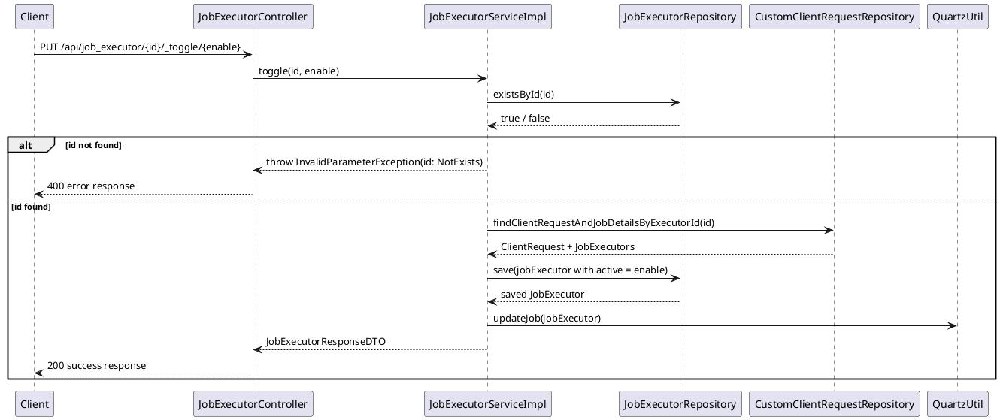

---

### 14. Instant Run Job Executor

| HTTP Method | Path | HTTP Header |
|---|---|---|
| GET | `/api/job_executor/{id}/_run` | Standard headers — see Shared Conventions |

**Request Body**

No request body — see path/query parameters

| Field | Type | Mandatory | Description |
|---|---|---|---|
| id | String | M | Id of the job executor to run immediately, out of its cron schedule |

**Response Body**
```json
{ "success": true, "data": true }
```

| Field | Type | Description |
|---|---|---|
| data | Boolean | `true` once the job is dispatched to Quartz for immediate execution |

**List Response Code**

| Code | Description |
|---|---|
| 200 | Success — see Shared Conventions |
| 400 | `id: NotExists` (`InvalidParameterException`) |

**Sequence Flow**
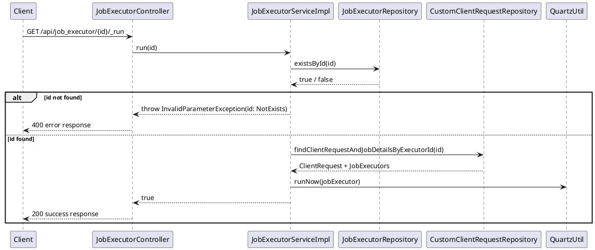
